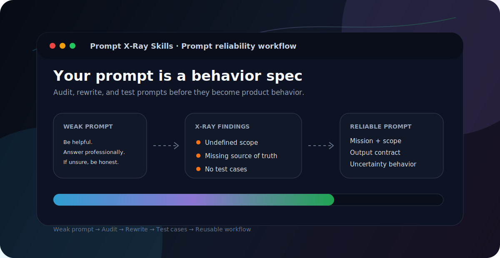

# Prompt X-Ray Skills

**Your prompt works in demos, then fails in production. X-Ray it first.**

Prompt X-Ray Skills is a practical `SKILL.md` workflow pack for auditing, rewriting, testing, and hardening prompts used in real AI systems:

- AI assistants
- support bots
- RAG applications
- coding agents
- structured-output pipelines
- automations
- internal AI tools

Most prompt resources give you examples.

Prompt X-Ray treats a prompt as a behavioral specification for an AI system.

That means a production prompt should define scope, source of truth, decision rules, output contract, uncertainty behavior, escalation paths, and test cases.

<p align="center">
  
</p>

<p align="center">
  
  
  
  
  
</p>

```text
weak prompt -> X-Ray audit -> improved prompt -> test cases -> reusable workflow
```

## Use this when you need to

- audit a weak prompt before using it in production;
- write a system prompt for an AI assistant;
- create `AGENTS.md`, `CLAUDE.md`, Cursor rules, or Codex instructions;
- define a RAG answer policy with citation and no-answer rules;
- design JSON / structured output that software can parse;
- generate prompt test cases and edge cases;
- debug bad LLM outputs;
- turn an AI assistant idea into a product spec.

## Try this in 5 minutes

Use the repository as a practical workflow, not as a reading list.

1. Open [`examples/before-after/simple-support-prompt.md`](examples/before-after/simple-support-prompt.md).
2. Copy the weak prompt.
3. Run [`skills/02-prompt-auditor/SKILL.md`](skills/02-prompt-auditor/SKILL.md) on it.
4. Compare the audit with the improved prompt in the example.
5. Run [`skills/07-prompt-test-generator/SKILL.md`](skills/07-prompt-test-generator/SKILL.md) to create quality-check cases.

Recommended first path:

```text
weak prompt -> prompt audit -> improved prompt -> quality-check cases -> reusable prompt
```

## Example: weak prompt to reliable prompt

Weak prompt:

```text
You are a helpful support assistant. Answer customer questions professionally and provide useful information. If you don't know something, be honest.
```

Prompt X-Ray flags the hidden risks:

| Area | Finding |
|---|---|
| Scope | The assistant's responsibility is undefined. |
| Source of truth | The prompt does not say what information the assistant should rely on. |
| Output contract | No required structure is defined. |
| Uncertainty behavior | "Be honest" is too vague for production use. |
| Escalation | No rule exists for account, billing, refund, or unsupported cases. |
| Testability | There are no pass/fail cases. |

Improved prompt includes:

```text
Mission
Source of Truth
Scope
Workflow
Style
Output Format
Missing Information Behavior
Escalation Rules
Test Cases
```

See the full before/after example: [`examples/before-after/simple-support-prompt.md`](examples/before-after/simple-support-prompt.md).

## What you get

Instead of collecting "magic prompts", this skill pack helps you produce practical artifacts:

- prompt briefs;
- prompt audit reports;
- rewritten production-ready prompts;
- system prompts;
- agent instructions;
- RAG answer policies;
- structured output schemas;
- prompt test cases;
- prompt debugging reports;
- product specifications for AI assistants and workflows.

## Installation and usage

This repository supports two styles:

1. **Router skill** — use the root [`SKILL.md`](SKILL.md) as one entry point for the whole skill pack.
2. **Individual skills** — use separate folders from [`skills/`](skills/) when you want narrow activation.

See [`docs/router-skill.md`](docs/router-skill.md) for the short router guide.

See [`docs/installation.md`](docs/installation.md) for platform-specific setup:

- Claude Code
- Claude.ai / Claude app
- Codex
- Cursor
- ChatGPT Projects
- manual usage in any LLM

Router usage example:

```text
Use prompt-xray-skills to audit this prompt.
```

Individual skill usage example:

```text
Audit this prompt using prompt-auditor.
```

## What this is

A prompt reliability toolkit for people building with LLMs.

It helps you turn rough prompt text into something closer to a small software specification: scoped, testable, reusable, and easier to debug.

## What this is not

This is not a list of magic prompts.

This is not a prompt marketplace.

This is not a collection of generic "act as..." templates.

The goal is not to make prompts longer.

The goal is to make prompts more reliable.

## Core philosophy

A good prompt should define:

1. Goal
2. Context
3. Role
4. Inputs
5. Constraints
6. Decision rules
7. Output format
8. Uncertainty behavior
9. Quality criteria
10. Test cases

If a prompt cannot be tested, it is not production-ready.

## Skills included

```text
skills/
  01-prompt-brief-builder/
  02-prompt-auditor/
  03-system-prompt-architect/
  04-agent-instruction-writer/
  05-rag-answer-policy/
  06-structured-output-designer/
  07-prompt-test-generator/
  08-prompt-debugger/
  09-prompt-to-product-spec/
```

## Recommended workflow

1. Start with `01-prompt-brief-builder` when the task is still vague.
2. Write or improve the prompt.
3. Run `02-prompt-auditor` to identify fragility.
4. Use `07-prompt-test-generator` to create test cases.
5. Use `06-structured-output-designer` when the output must be consumed by software.
6. Use `08-prompt-debugger` when real outputs fail.
7. Convert stable workflows into specs or agent rules when needed.

## Example workflows

### Improve a weak prompt

```text
01-prompt-brief-builder -> 02-prompt-auditor -> 07-prompt-test-generator
```

Use this when you have a vague prompt and want to make it reusable.

### Create a system prompt for an assistant

```text
01-prompt-brief-builder -> 03-system-prompt-architect -> 02-prompt-auditor
```

Use this for support bots, sales assistants, internal AI tools, and website assistants.

### Prepare instructions for a coding agent

```text
04-agent-instruction-writer -> 02-prompt-auditor -> 07-prompt-test-generator
```

Use this for `CLAUDE.md`, `AGENTS.md`, Cursor rules, Codex instructions, and repository-specific AI workflows.

### Build a RAG answer policy

```text
05-rag-answer-policy -> 03-system-prompt-architect -> 07-prompt-test-generator
```

Use this for knowledge-base bots, course assistants, documentation assistants, and customer-support RAG systems.

### Convert an AI idea into a product spec

```text
01-prompt-brief-builder -> 09-prompt-to-product-spec
```

Use this when a prompt or assistant concept needs to become an MVP task for a developer or coding agent.

## Who this is for

- AI builders
- developers using coding agents
- prompt engineers
- AI consultants
- product managers
- automation specialists
- founders building AI-powered products
- teams using LLMs in real workflows

## How to use these skills

Each skill is a folder containing a `SKILL.md` file.

You can copy a skill folder into an LLM environment that supports skill-style workflows, or simply paste the `SKILL.md` instructions into your AI workspace when you need that workflow.

The skills are intentionally practical and implementation-oriented. They are designed to produce usable artifacts: prompt briefs, audits, rewritten prompts, schemas, test cases, policies, and product specs.

## Examples

See [`examples/README.md`](examples/README.md) for a guided example catalog.

Quick links:

- [`examples/before-after/simple-support-prompt.md`](examples/before-after/simple-support-prompt.md)
- [`examples/before-after/lead-research-prompt.md`](examples/before-after/lead-research-prompt.md)
- [`examples/before-after/prompt-brief-builder-example.md`](examples/before-after/prompt-brief-builder-example.md)
- [`examples/business-assistant/system-prompt.md`](examples/business-assistant/system-prompt.md)
- [`examples/coding-agent/AGENTS.md`](examples/coding-agent/AGENTS.md)
- [`examples/rag-assistant/support-answer-policy.md`](examples/rag-assistant/support-answer-policy.md)
- [`examples/structured-output/lead-qualification-schema.md`](examples/structured-output/lead-qualification-schema.md)

## Design principles

See [`docs/principles.md`](docs/principles.md).

## Authoring guide

See [`docs/skill-authoring-guide.md`](docs/skill-authoring-guide.md).

## Launch notes

See [`docs/launch-post.md`](docs/launch-post.md).

## Repository topics to consider

If you maintain this repository, consider adding these GitHub topics for discovery:

```text
prompt-engineering llm ai-agents system-prompts rag structured-output claude-code codex cursor agents-md prompt-testing prompt-evals ai-workflows
```

## License

MIT
